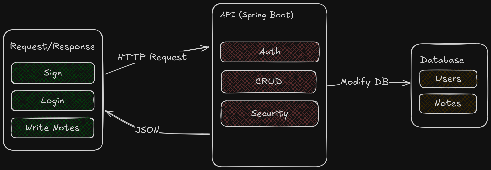

# API Notes with Reactive Spring Boot
I created this project to learn about reactive programming with Spring Boot. This is my first time using reactive programming in Spring Boot. The goal is to create an API with basic CRUD operations and security features (authentication, JWT tokens, and encryption).

## Image Flowmap


## Goals
The skills you will learn from this project include:

- User authentication
- Schema design and databases
- RESTful API design
- CRUD operations
- Error handling
- Security
- Implementing filtering and sorting for the to-do list **(Bonus)**
- Implementing unit tests for the API **(Bonus)**
- Implementing rate limiting and throttling for the API **(Bonus)**
- Implementing a refresh token mechanism for authentication **(Bonus)**
## Requirements
Develop a RESTful API with the following technologies:
1. **ID**: Use UUIDv7 as the primary key
2. **Password**: Use bcrypt hashing algorithm to hash passwords

Develop a RESTful API with the following endpoints:

1. **User Registration**: Create a new user
2. **Login**: Authenticate the user and generate a token
3. **CRUD Operations**: Manage the notes
4. **User Authentication**: Allow only authorized users to access the notes
5. **Error Handling and Security**: Implement necessary measures
6. **Database**: Store user and notes data (any database of your choice)
7. **Data Validation**: Ensure proper data validation
8. **Pagination and Filtering**: Implement for the notes
9. **Rate Limiting and Throttling**: Implement for the API
10. **Refresh Token Mechanism**: Implement for authentication

### User Registration
```json
Endpoint: POST /api/v1/auth/register

Request Body:
{
  "name": "John Doe",
  "email": "john@doe.com",
  "password": "password"
}

Responses (200 - Success):
{
  "token": "eyJhbGciOiJIUzI1NiIsInR5cCI6IkpXVCJ9"
}
```

### User Login
```json
Endpoint: POST /api/v1/auth/login

Request Body:
{
  "email": "john@doe.com",
  "password": "password"
}

Responses (200 - Success):
{
  "token": "eyJhbGciOiJIUzI1NiIsInR5cCI6IkpXVCJ9"
}
```
### Refresh Token
```json
Endpoint: POST /api/v1/auth/refresh

Request Body:
{
  "refreshToken": "eyJhbGciOiJIUzI1NiIsInR5cCI6IkpXVCJ9"
}

Responses (200 - Success):
{
  "token": "eyJhbGciOiJIUzI1NiIsInR5cCI6IkpXVCJ9"
}
Responses (401 - Failed):
{
  "message": "Unauthorized"
}
```
### Create a Notes Item
```json
Endpoint: POST /api/v1/notes

Request Body:
{
  "title": "Buy groceries",
  "description": "Buy milk, eggs, and bread"
}

Responses (200 - Success):
{
  "id": 1,
  "title": "Buy groceries",
  "description": "Buy milk, eggs, and bread"
}
Responses (401 - Failed):
{
  "message": "Unauthorized"
}
```

### Update a Notes Item
```json
Endpoint: PUT /api/v1/notes/{id}

Request Body:
{
  "title": "Buy groceries",
  "description": "Buy milk, eggs, bread, and cheese"
}

Responses (200 - Success):
{
  "id": 1,
  "title": "Buy groceries",
  "description": "Buy milk, eggs, bread, and cheese"
}
Responses (403 - Failed):
{
  "message": "Forbidden"
}
```

### Delete a Notes Item
```json
Request:
DELETE /api/v1/notes/{id}

Responses (204 - Success):
{}
```

### Get Notes Items
```json
Endpoint: GET /api/v1/notes?page=1&limit=10

Responses (200 - Success):
{
  "data": [
    {
      "id": 1,
      "title": "Buy groceries",
      "description": "Buy milk, eggs, bread"
    },
    {
      "id": 2,
      "title": "Pay bills",
      "description": "Pay electricity and water bills"
    }
  ],
  "page": 1,
  "limit": 10,
  "total": 2
}
```

Enjoy Coding! 😉